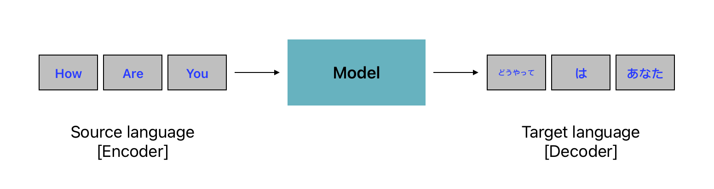

# Machine Translation

Machine translation is the process of using artificial intelligence to automatically translate text from one language to another without human involvement. It translation goes beyond simple word-to-word translation to communicate the full meaning of the original language text in the target language. It analyzes all text elements not just grammetical words and recognizes how the words influence one another.


### ➤ Approach

In machine translation, the original text or language is called source language, and the language you want to translate it to is called the target language. Machine translation works by :

- Decode the source language meaning of the original text
- Encode the meaning into the target language


<figure markdown="span">
    
  <figcaption>Machine Translation</figcaption>
</figure>


#### ➤ Rule-Based Machine Translation

Rule-based machine translation relies on these resources to ensure precise translation of specific content. The process involves the software parsing input text, generating a transitional representation, and then converting it into the target language with reference to grammar rules and dictionaries.

Language experts develop built-in linguistic rules and bilingual dictionaries for specific industries or topics. Rule-based machine translation uses these dictionaries to translate specific content accurately. 

Rule-based machine translation can be customized to a specific industry or topic. It is predictable and provides quality translation. However, it produces poor results if the source text has errors or uses words not present in the built-in dictionaries. The only way to improve it is by manually updating dictionaries regularly.

#### ➤ Statistical Machine Translation

Instead of relying on linguistic rules, statistical machine translation utilizes machine learning for text translation. Machine learning algorithms examine extensive human translations, identifying statistical patterns. When tasked with translating a new source text, the software intelligently guesses based on the statistical likelihood of specific words or phrases being associated with others in the target language.

- Syntax-based machine translation: Syntax-based machine translation is a sub-category of statistical machine translation. It uses grammatical rules to translate syntactic units. It analyzes sentences to incorporate syntax rules into statistical translation models.

Statistical methods require training on millions of words for every language pair. However, with sufficient data the machine translations are accurate.

#### ➤ Neural Machine Translation (NMT)

A neural network, inspired by the human brain, is a network of interconnected nodes functioning as an information system. Input data passes through these nodes to produce an output. Neural machine translation software utilizes neural networks to process vast datasets, with each node contributing a specific change from source text to target text until the final result is obtained at the output node.

Neural machine translation software uses neural networks to work with enormous datasets. Each node makes one attributed change of source text to target text until the output node gives the final result.

#### ➤ Hybrid Machine Translation

Hybrid machine translation tools integrate multiple machine translation models within a single software application, leveraging a combination of approaches to enhance the overall effectiveness of a singular translation model. This process typically involves the incorporation of rule-based and statistical machine translation subsystems, with the ultimate translation output being a synthesis of the results generated by each subsystem. You can use the hybrid approach to improve the effectiveness of a single translation model. 

#### 👩🏻‍💻 Implementation

```py
from transformers import pipeline

text = [
    "Brevity is the soul of wit.",
    "I would like to go there",
    "Did you see that car",
    "good morning",
    "There are 3 colors",
]

# model to translate (english to french)
model_checkpoint = "Helsinki-NLP/opus-mt-en-fr"
pipe = pipeline("text-classification", model=model_ckpt)
translator = pipeline("translation", model=model_checkpoint)
translator(text)
```

**Result**

```shell
[{'translation_text': "La vérité est l'âme de l'esprit."},
 {'translation_text': "J'aimerais y aller."},
 {'translation_text': 'Avez-vous vu cette voiture ?'},
 {'translation_text': 'Bonjour.'},
 {'translation_text': 'Il y a 3 couleurs'}]
```