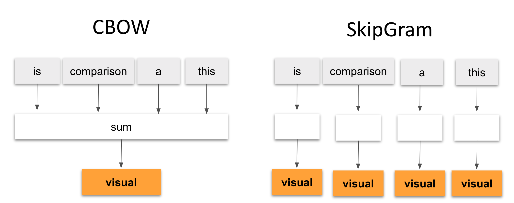

# Text Encoding

Text encoding is a fundamental process to convert text into number or vector representation so as to preserve the context and relationship between words and sentences, such that a machine can understand the pattern associated in any text and can make out the context of sentences.

As machines understands only numbers, these text data needs to converted into numerical data (hence text encoding is needed).

Text encoding involves assigning a numerical value to each character/word in the text. These numerical values are then converted into binary code, which can be stored and processed by the computer. 

### ➤ BOW

Bag Of Words encodes sentences using the entire data corpus. It is a representation of text that describes the occurrence of words within a document. It is called a "bag" of words, because any information about the order or structure of words in the document is discarded. This only concerned with **whether known words occur in the document**, not where in the document. BOW is simple  and easy to implement, making it a good choice for basic text analysis tasks.

!!! Example

        sentence = "Odd number is a good number and numbers are good"

        o/p: [1, 2, 0, 0, 2, 0, 1, 0]


BOW does not capture word semantics or meaning. Also BOW struggles with out-of-vocabulary words that were not seen during training. So it is not good for tasks that requires deep semantic understanding.

##### 👩🏻‍💻 Implementation

```py
from nltk.corpus import stopwords

# build vocab to store unique words
def vocab(text):
    vocabulary = []
    for w in word:
        if w not in vocabulary:
            vocabulary.append(w)
    return vocabulary

def bow_encoding(text):
    """ Bag of words."""
    word = text.split()
    vocabulary = vocab(text)

    # Initialize a vector of zeros with the same length as the vocabulary
    bow_vector = [0] * len(vocabulary)
    stop_words = set(stopwords.words('english'))
    filtered_words = [w for w in word if w.lower() not in stop_words]
    word_to_index = {word: idx for idx, word in enumerate(vocabulary)}

    for word in filtered_words:        
        if word in word_to_index:
            bow_vector[word_to_index[word]] += 1
    return bow_vector

text = "Some input text"

```

### ➤ One hot encoding

One hot encoding converts text data into categorical data, such as words or the characters into a **binary vector representation**. Each unique category (word or character) is represented by a binary vector where only one element is set to 1, while all others are set to 0.

First text data needs to be tokenized an afterwords build a vocabulary that contains all unique words or tokens present in your corpus. For each word or token in your vocabulary, create a binary vector of the same length as the vocabulary size. In this binary vector, only one element is set to 1, representing the position of the word in the vocabulary.

!!! Example

    sentence = "Odd number is a good number and numbers are good"

        [[1, 0, 0, 0, 0, 0, 0, 0, 0, 0],    # Odd(1)
        [0, 1, 0, 0, 0, 1, 0, 0, 0, 0],     # number(2) number(6)
        [0, 0, 1, 0, 0, 0, 0, 0, 0, 0],     # is(3)
        [0, 0, 0, 1, 0, 0, 0, 0, 0, 0],     # a(4)
        [0, 0, 0, 0, 1, 0, 0, 0, 0, 1],     # good(5) good(10)
        [0, 1, 0, 0, 0, 1, 0, 0, 0, 0],     # number(2) number(6)
        [0, 0, 0, 0, 0, 0, 1, 0, 0, 0],     # and(7)
        [0, 0, 0, 0, 0, 0, 0, 1, 0, 0],     # numbers(8)
        [0, 0, 0, 0, 0, 0, 0, 0, 1, 0],     # are(9)
        [0, 0, 0, 0, 1, 0, 0, 0, 0, 1]]     # good(5) good(10)


It is straightforward and easy to implement approach and each representation is independent of each other words. But the encoded vectors can be very high dimensional, especially for large vocabularies, which can lead to computational inefficiency and memory usage.

##### 👩🏻‍💻 Implementation
```py
def one_hot_encoding(text):
    """ One hot encoding."""
    word = text.split()
    encoded_text = []
    for each in word:
        one_hot_encoded = [1 if word == each else 0 for word in word]
        encoded_text.append(one_hot_encoded)
    return encoded_text
```


### ➤ Index based

As in name, The Index based encoding involves assigning a unique index to each token in the text, allowing it to uniquely identify and represent all tokens within the corpus by their respective index values.

!!! Example

    sentence = "Odd number is a good number and numbers are good"

    By assigning each token a unique index

        {
            "Odd": 1,
            "number": 2,
            "is": 3,
            "a": 4,
            "good":5, 
            "number":2,
            "and": 6,
            "numbers": 7,
            "are": 8,
            "good": 5
        }


Now we have encoded all the words with index numbers, it is now machine reable and this can be used as input.

Index based are easy to use as words converted/assigned to unique index value but for using this encoding make sure that all sentences are equally long. By that means if the first sentence has 4 words but the last sentence has 5 words, this will cause an imbalance.

So this issue **max padding** is used, which takes the longest sentence from document corpus and pad the other sentence to be as long. This means if all sentences are of 4 words and one sentence is of 5 words max padding will make all the sentences of 5 words by using **extra index 0**.

 "[1, 2, 3, 4, 0]" 
 
 "[5, 6, 7, 2, 0]" 
 
 "[4, 8, 9, 10, 0]" 
 
 "[11, 12, 2, 5, 13]"


Index-Based Encoding considers the sequence information in text encoding. Also index-based encoding results in high-dimensional sparse vectors where all words are treated as independent entities and there is no similarity information encoded in the vectors.

##### 👩🏻‍💻 Implementation

```py
def index_based_encoding(text):
    """ Index based encoding."""
    word = text.split()
    encoded_corpus = []
    encoded_sentence = [word_to_index[w]+1 for w in word]
    encoded_corpus.append(encoded_sentence)
    return encoded_corpus  
```

### ➤ TF-IDF

TFIDF known as Term Frequency-Inverse Document Frequency. It can be defined as the calculation of how relevant a word in a series or corpus is to a text. The meaning increases proportionally to the number of times in the text a word appears but is compensated by the word frequency in the corpus.

Let's see the terminology for better understanding.

**Term Frequency (TF)** 

This component measures how frequently a word appears in a document. It gives higher weight to words that occur more frequently in a document. The number of times a term occurs in a document is called its term frequency. The weight of a term that occurs in a document is simply proportional to the term frequency.

$$
    tf(t,d) = \frac{\text{count of t in d}}{\text{number of words in d}}
$$

**Document Frequency (DF)** 

Document frequency measures the importance of a document in a whole set of corpus. This is very similar to TF. The only difference is that TF is a frequency counter for a term t in document d, whereas DF is the count of occurrences of term t in the document set N. In other words, DF is the number of documents in which the word is present. We consider one occurrence if the term consists in the document at least once. We don’t need to know the number of times the term is present.

$$
    df(t) = \text{occurrence of t in documents}
$$


**Inverse Document Frequency (IDF)** 

IDF measures the importance of a word in the entire corpus by considering how many documents contain the word. Words that are common across many documents receive lower IDF scores, while words that are rare or unique to a few documents receive higher scores.


$$
    idf(t) = log(N/ df(t))
$$

where

df(t) = Document frequency of a term t 

N(t) = Number of documents containing the term t


##### 👩🏻‍💻 Implementation

```py
def tfidf_encoding(text):
    """ Term Frequency Inverse Document Frequency. """
    from sklearn.feature_extraction.text import TfidfVectorizer
    from pandas import DataFrame

    tfidf_vectorizer = TfidfVectorizer(stop_words=stopwords.words('english'))
    tfidf_matrix = tfidf_vectorizer.fit_transform([text])
    # tfidf_matrix : (doc_is, term_index) score/value -- generates csr_matrix
    feature_names = tfidf_vectorizer.get_feature_names_out()
    print(f"{feature_names=}")

    tfidf_df = DataFrame(data=tfidf_matrix.toarray(), columns=feature_names)
    return tfidf_df, tfidf_matrix
```

### ➤ Word2vec

Word2Vec is a popular nlp technique for generating word embedding, which are vector representations of words in a continuous vector space. Word embedding capture semantic relationships between words, making them suitable for various nlp tasks like language modeling, sentiment analysis, and machine translation. Word2Vec has two main algorithms: Continuous Bag of Words (CBOW) and Skip-gram.

The word2vec tool takes a text corpus as input and produces the word vectors as output. It first constructs a vocabulary from the training text data and then learns vector representation of words. The resulting word vector file can be used as features in many natural language processing and machine learning applications.

Word2Vec consists of a shallow neural network with a single hidden layer. The input and output layers have a vocabulary size equal to the number of unique words in the corpus. The hidden layer contains the word embedding.

<figure markdown="span">
    
  <figcaption>CBOW and Skipgram</figcaption>
</figure>


**CBOW**
We have to predict target word using context words. Several parameters such as window size, vocab size, etc are defined according to the problem domain. One hot encoding is done for each word input. The output vector (Embedding Dimension) for each word nothing but the weight value of hidden layer to the outer layer.


**Skip-Gram**
We have to predict context words using target word. Here also several parameters defined. Architectures is exact opposite as CBOW. The output vector (Embedding Dimension) for each word nothing but the weight value of first input layer to the hidden layer.

##### 👩🏻‍💻 Implementation

```py
def word2vec_encoding(text, term1='', term2='', model="en_core_web_sm"):
    """ Word2vec. """
    from spacy import load, info
    # print(info()['pipelines'].keys()) # list out installed model
    spacy_model = load(model)
    doc = spacy_model(text)
    match_term = spacy_model(term2)

    similarity = [token.similarity(term2) for token in doc for term2 in match_term if token.text==term1]
    return similarity
```

