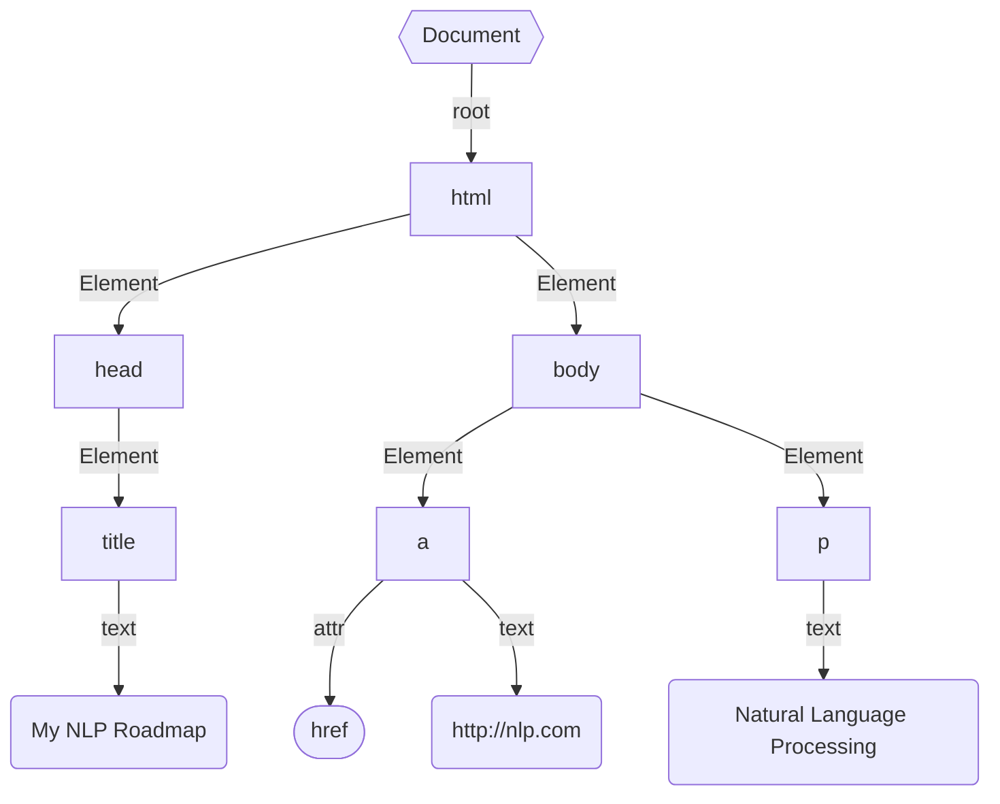

# HTML Parser
As we know Browser understands HTML. So web data is in Hyper Text Markup Language which has a tree-like data structure that powers the web. To get data from web documents parsing is needed.

#### HTML structure

HTML DOM structure



## Parse HTML

Parse html with beautifulsoup 

Install 
```py
pip install beautifulsoup4
```

#### get html content from url

```py
from urllib.request import urlopen

with urlopen('https://docs.python.org/3/library/urllib.request.html') as r:
    html_text = r.read().decode('utf-8')
```

#### get title content

```py
from bs4 import BeautifulSoup

# make object
soup = BeautifulSoup(html_text, 'html.parser')
print(soup.title.string)
# urllib.request — Extensible library for opening URLs — Python 3.12.3 documentation
```

#### get data with removed spaced

```py
fetch = soup.head.stripped_strings
print([repr(f) for f in fetch])
# ["'urllib.request — Extensible library for opening URLs — Python 3.12.3 documentation'"]
```

#### get parent tag data

```py
fetch = soup.a
print([f.name for f in fetch.parent])
```

#### get siblings tag data

```py
fetch = soup.a
print([repr(f) for f in fetch.next_siblings]) 
print([repr(f) for f in fetch.previous_siblings]) 
```

#### find tag data with id
  
```py
fetch = soup.find("a", id="reference internal")
print(fetch.text)
# urllib.request — Extensible library for opening URLs

fetch = soup.find_all("a", id="reference internal", limit=5)
print([f.text for f in fetch])
# ['urllib.request — Extensible library for opening URLs', 'Request Objects', 'OpenerDirector Objects', 'BaseHandler Objects', 'HTTPRedirectHandler Objects']
```

#### find with string match
  
```py
text = 'must be an'
soup.find_all(string=re.compile(text), limit=2)
# [' must be an object specifying ...', ' must be an object ... ']
```