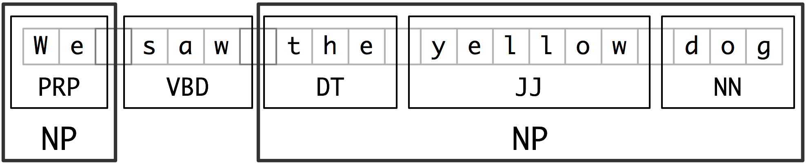

# Parser
The word *pars* means ‘parts of speech’, from Old French pars ‘parts’ (influenced by Latin pars ‘part’). Parser is to analyse (a string or text) into logical syntactic components.

---

## Introduction

Parser helps to detect syntax errors, create a parse tree and symbol table or generate Intermediate Representations(IR).

There are many different ways to categorize sentence structures. One way is to classify the words by grouping them as a single unit or phrase, which is also known as a constituent.

Different language has different rules and structures. But there are common grammer rules that are of a noun phrase, verb phrase, and prepositional phrase structured as follows:


> Sentence = S = Noun Phrase + Verb Phrase + Preposition Phrase 
> 
> S = NP + VP + PP


The different word groups that exist according to English grammar rules are:

> Noun Phrase(NP): Determiner + Nominal Nouns = DET + Nominal 
> 
> Verb Phrase (VP): Verb + range of combinations 
> 
> Prepositional Phrase (PP): Preposition + Noun Phrase = P + NP 

**EX** : <u>the  boy</u> (Noun) <u>ate</u> (verb) <u>the pancakes</u> (Noun).

#### NLTK

NLTK includes pre-trained Punkt tokenizer which is used to tokenize the words  and
averaged_perceptron_tagger which is used to tag those tokenized words to Parts of Speech.

##### POS tags in nltk
```py
import nltk
nltk.download('tagsets')
nltk.help.upenn_tagsets('DT')
```

| Tag      | Meaning                          |
| :---------- | :----------------------------------- |
| `CC` | coordinating conjunction|
| `CD` | cardinal digit|
| `DT` | determiner|
| `EX` | existential there (like: “there is” … think of it like “there exists”)|
| `FW` | foreign word|
| `IN` | preposition/subordinating conjunction|
| `JJ` | adjective ‘big’|
| `JJR` | adjective, comparative ‘bigger’|
| `JJS` | adjective, superlative ‘biggest’|
| `LS` | list marker|
| `MD` | modal could, will|
| `NN` | noun, singular ‘desk’|
| `NNS` | noun plural ‘desks’|
| `NNP` | proper noun, singular ‘Harrison’|
| `NNPS` | proper noun, plural ‘Americans’|
| `PDT` | predeterminer ‘all the kids’|
| `POS` | possessive ending parent’s|
| `PRP` | personal pronoun I, he, she|
| `PRP$` | possessive pronoun my, his, hers|
| `RB` | adverb very, silently,|
| `RBR` | adverb, comparative better|
| `RBS` | adverb, superlative best|
| `RP` | particle give up|
| `TO,` | to go ‘to’ the store.|
| `UH` | interjection, errrrrrrrm|
| `VB` | verb, base form take|
| `VBD` | verb, past tense took|
| `VBG` | verb, gerund/present participle taking|
| `VBN` | verb, past participle taken|
| `VBP` | verb, sing. present, non-3d take|
| `VBZ` | verb, 3rd person sing. present takes|
| `WDT` | wh-determiner which|
| `WP` | wh-pronoun who, what|
| `WP$` | possessive wh-pronoun whose|
| `WRB` | wh-abverb where, when|

##### POS tagwords

```py
nltk.corpus.brown.tagged_words(tagset='universal')
```

| Tag      | Example                          |
| :---------- | :----------------------------------- |
| `ADJ`       | adjective	(new, good, high, special, big, local) |
| `ADP`|adposition	(on, of, at, with, by, into, under)|
|`ADV` |adverb (really, already, still, early, now)|
|`CONJ` |conjunction (and, or, but, if, while, although)|
|`DET` |determiner, article (the, a, some, most, every, no, which)|
|`NOUN` |noun (year, home, costs, time, Africa)|
|`NUM` |numeral (twenty-four, fourth, 1991, 14:24)|
|`PRT` |particle (at, on, out, over per, that, up, ith)|
|`PRON` |pronoun (he, their, her, its, my, I, us)
|`VERB` |verb (is, say, told, given, playing, would)|
|`.` |punctuation marks (. , ; !)|
|`X` |other (ersatz, esprit, dunno, gr8, univeristy)|

#### Information Extraction

<figure markdown="span">
    
  <figcaption>Information Extraction System Architecture (https://www.nltk.org/book_1ed/ch07.html)</figcaption>
</figure>

Information extraction is the very first and important step in NLP.
Let's see more in detail.

```py
def preprocess(document):
    sentences = nltk.sent_tokenize(document) # sentence segmenter
    tokens = [nltk.word_tokenize(sent) for sent in sentences] # word tokenizer
    pos = [nltk.pos_tag(sent) for sent in tokens] # pos
    return sentences, tokens, pos

sentence = "Well! If Alex can come by 4 o\'clock at Mall."
segment, token, pos = preprocess(sentence)
```
gives

```py
segment=['Well!', "If Alex can come by 4 o'clock at Mall."]
token=[['Well', '!'], ['If', 'Alex', 'can', 'come', 'by', '4', "o'clock", 'at', 'Mall', '.']]
pos=[[('Well', 'RB'), ('!', '.')], [('If', 'IN'), ('Alex', 'NNP'), ('can', 'MD'), ('come', 'VB'), ('by', 'IN'), ('4', 'CD'), ("o'clock", 'NN'), ('at', 'IN'), ('Mall', 'NNP'), ('.', '.')]]
```    

#### Chuncking

Chunking, which segments and labels multi-token sequences as illustrated below. The smaller boxes show the word-level tokenization and part-of-speech tagging, while the large boxes show higher-level chunking. Each of these larger boxes is called a chunk. Like tokenization, which omits whitespace, chunking usually selects a subset of the tokens. Also like tokenization, the pieces produced by a chunker do not overlap in the source text.

<figure markdown="span">
    
  <figcaption>Segmentation and Labeling at both the Token and Chunk Levels (https://www.nltk.org/book_1ed/ch07.html)</figcaption>
</figure>

Example
```py
def regex_based_chunks(sentence):
    # rule: NP chunk should be formed whenever the 
    # chunker finds an optional determiner (DT) followed 
    # by any number of adjectives (JJ) and then a noun (NN)
    grammar = "NP: {<DT>?<JJ>*<NN>}" 
    # create chunk parser
    cp = nltk.RegexpParser(grammar) 
    result = cp.parse(sentence) 
    return result

# chunk structures must contain tagged tokens or trees 
pos = [('Well', 'RB'), ('!', '.'), ('If', 'IN'), ('Alex', 'NNP'), ('can', 'MD'), ('come', 'VB'), ('by', 'IN'), ('4', 'CD'), ("o'clock", 'NN'), ('at', 'IN'), ('Mall', 'NNP'), ('.', '.')] 
regex_based_chunks(pos)
```
gives
```py
chunks=Tree('S', 
            [('Well', 'RB'), ('!', '.'), ('If', 'IN'), ('Alex', 'NNP'), ('can', 'MD'), ('come', 'VB'), ('by', 'IN'), ('4', 'CD'), 
            Tree('NP', 
                [("o'clock", 'NN')]), ('at', 'IN'), ('Mall', 'NNP'), ('.', '.')])
```

#### Using Spacy
```py
import spacy
# Loading the model
nlp=spacy.load('en_core_web_sm')
text = "Tim Cook is the CEO of Apple company founded by Steve Jobs and Steve Wozniak in April 1976."

doc=nlp(text)
for token in doc:
    print(token.text,'-->',token.dep_)

# result
Tim --> compound
Cook --> nsubj
is --> ROOT
the --> det
CEO --> attr
of --> prep
Apple --> compound
company --> pobj
founded --> acl
by --> agent
Steve --> compound
Jobs --> pobj
and --> cc
Steve --> compound
Wozniak --> conj
in --> prep
April --> pobj
1976 --> nummod
. --> punct
```