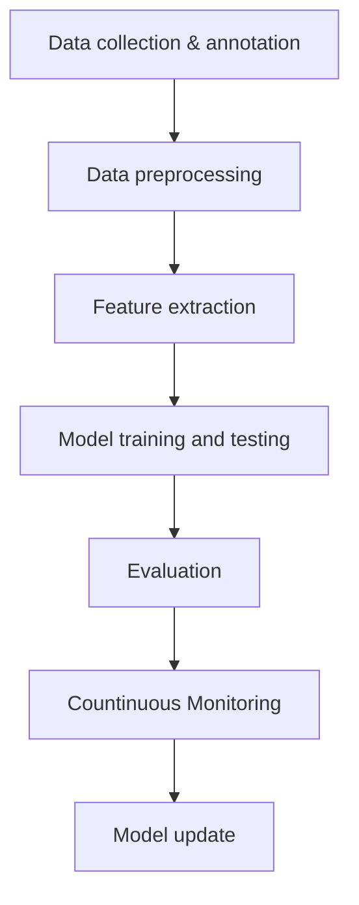

# Intent detection

Intent detection is the process of determining the underlying intention or goal behind a given piece of text or spoken language. It involves classifying user inputs into predefined categories, where each category represents a specific intent or purpose.


### Intent detection process

Intent detection involves several key components, including machine learning algorithms, data preprocessing, training, and evaluation.



#### ➤ Data Preprocessing and Feature Extraction

Firstly, in order to prepare input data for model training it needs to clean which is done by data preprocessing. It includes tokenization, remove stop words or other fuzzy data or symbols, lemmatization or stemming followed by feature extraction(converting into numerical form i.e. embeddings).

#### ➤ Model training and testing

Dataset with intent label are trained by splitting it into trainig, testing and validation. In trainig phase model learns to map inputs to their corresponding intent categories by setting model hyperparameters to optimize performance. Naive bias, Support vector machine, Decision trees and random forest, CNN, RNN, BERT and GPT are widely used for intent detection.

#### ➤ Evaluation matrices

After trainig, to check the performance evaluation matrices like F1 score(mean of precision and recall) is used.

#### 👩🏻‍💻 Implementation

Intent detection with Tfidf and Naivebayes.

Imports

```py
from sklearn.feature_extraction.text import TfidfVectorizer
from sklearn.naive_bayes import MultinomialNB
```

Create tfidf vector and transform data

```py
training_data = [
     ('i want to buy a jeans pent', 'Buy_a_product'),
     ('i want to purchase a pair of shoes', 'Buy_a_product'),
     ('are you selling laptops', 'Buy_a_product'),
     ('i need an apple jam', 'Buy_a_product'),
     ('can you please tell me the price of this product', 'Buy_a_product'),
     ('please give me some discount.', 'negotition'),
     ("i cannot afford such price", 'negotition'),
     ("could you negotiate", "negotition"),
     ("i agree on your offer", "success"),
     ("yes i accepcted your offer", "success"),
     ("offer accepted", "success"),
     ("agreed", "success"),
     ("what is the price of this watch", "ask_for_price"),
     ("How much it's cost", "ask_for_price"),
     ("i will only give you 3000 for this product", "counter_offer"),
     ("Its too costly i can only pay 1500 for it", "counter_offer"),
]

test_data = [
    'your offer',
    'it will cost you 10000',
    'i need chocolate',
    'i want to buy t-shirts',
    'does it cost 30',
]

vectorizer = TfidfVectorizer()
data = [t[0] for t in training_data]
intent = [t[1] for t in training_data]

X = vectorizer.fit_transform(data)     # train
Y = vectorizer.transform(test_data)    # test
```

Classify data with Naivebayes multinomiaNB model

```py
clf = MultinomialNB()
clf.fit(X, intent)              
result = clf.predict(Y) # test
prob = clf.predict_proba(Y)
acc = clf.score(X, intent) # train

print("Prediction=", result)
print("accuracy=", acc)
```

**Result**

```shell
prediction=array(['success', 'Buy_a_product', 'Buy_a_product', 'Buy_a_product',
       'Buy_a_product'], dtype='<U13')
accuracy=0.9375
```