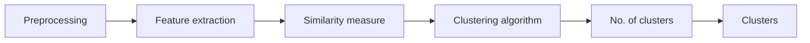

# Text Clustering

Text Clustering is type of unsupervised learning and the fundamental concept in natural language processing (nlp). The primary goal of text clustering is to organize a collection of documents into groups or clusters, based on the similarity of their content. Text clustering also helps to identify patterns and structures within the data, providing valuable insights into the relationships between documents.

Text clustering use vector space models, where documents are represented as numerical vectors in a high-dimensional space. Clustering algorithms then operate on these vector representations to partition the documents into clusters. After, each document is assigned to a cluster based on its similarity to other documents in that cluster. This allows for the exploration and analysis of the resulting clusters to gain insights into the underlying structure of the text data. 

Text clustering can be used for information retrieval, text summarization and topic modeling, to aid in tasks such as document organization, recommendation systems, and content analysis.

### ➤ Types of Clustering

#### 1. K-means Clustering

K-means clustering is mostly used unsupervised learning clustering algorithm that organizes data points into groups based on similarities. The algorithm operates by iteratively assigning each data point to its nearest cluster centroid and then recalculating the centroids based on the newly formed clusters.

#### 2. Hierarchical Clustering

Hierarchical clustering is a type of clustering algorithm that groups similar documents into a tree-like structure. It combines the clusters until they encompass all the documents into a single cluster. It is a useful technique for exploring the structure of the data. 

#### 3. Latent Dirichlet Allocation (LDA)

Latent Dirichlet Allocation (LDA) models use probabilistic modeling for topic modeling. LDA assumes that each document is a mixture of topics, and concomitantly, each topic is a distribution over words.

#### 4. DBSCAN

DBSCAN is a density-based clustering algorithm that groups similar documents based on their density.
DBSCAN works by identifying dense regions of data and grouping them.

#### 5. Fuzzy Clustering

Fuzzy Clustering is an extension of K-Means that allows a data point to belong to multiple clusters, with a degree of membership. The algorithm uses a membership matrix to represent the fuzzy cluster assignment. Fuzzy Clustering assigns each document to multiple clusters with different degrees of membership.

#### 6. Mean Shift Clustering

Mean Shift Clustering is a non-parametric clustering algorithm that groups similar documents based on their local maxima.

#### 7. Spectral Clustering

Spectral Clustering is a type of clustering algorithm that uses the eigenvalues and eigenvectors of the data matrix to group similar documents.

### ➤ Steps

#### 1. Preprocessing

The first step in text clustering is to preprocess the text data that includes cleaning and preprocessing of the text data to eliminate unwanted characters, converting all text to lowercase, removing stop words, stemming and lemmatizing words, and transforming the data into a numerical representation, such as a term frequency-inverse document frequency (TF-IDF) matrix

#### 2. Feature extraction

The next step is to extract features from the text data that can be used to calculate the similarity between documents. This involves converting the text into a set of numerical features that can be used for clustering. There are many different feature extraction techniques available, such as bag-of-words, TF-IDF, and word embeddings.

#### 3. Similarity measure

After features extraction, a similarity measure is used to determine the similarity between pairs of documents. This can involve calculating the Euclidean distance, Cosine similarity, or Jaccard similarity between documents

#### 4. Clustering algorithm

The next step is to apply a clustering algorithm to group the documents into clusters. Algorithms include k-means, hierarchical clustering, fuzzy logic and DBSCAN. The choice of algorithm will depend on the nature of the data, the desired number of clusters, and the computational resources available

#### 5. No. of clusters

The next step is to choose the number of clusters. Which is very important and critical step in text clustering that not only determines the final output but also plays a pivotal role in the process. There are many different methods available for choosing the number of clusters, such as the elbow method, silhouette score and gap statistic.

#### 6. Clusters

The final step is to perform the clustering that entails employing the selected clustering algorithm to the feature matrix and subsequently categorizing the documents into clusters.

### ➤ Applications

- Document Organizing
- Topic Modeling
- Sentiment Analysis
- Recommandation system

### ➤ Example
- [K means clustering](https://github.com/kjdeveloper8/nlp-projects/blob/main/src/text_clustering/k_means_clustering.ipynb)
  