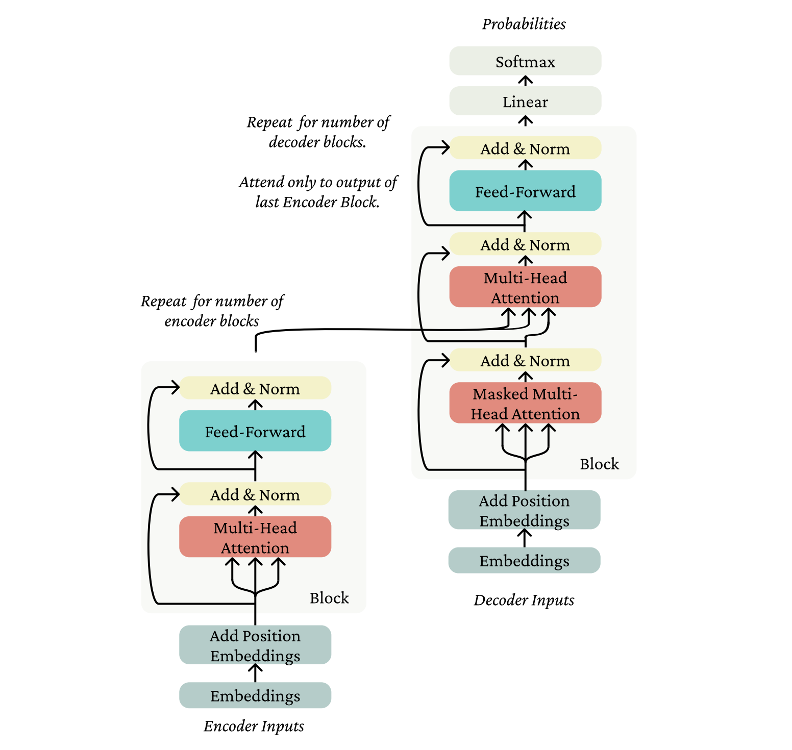
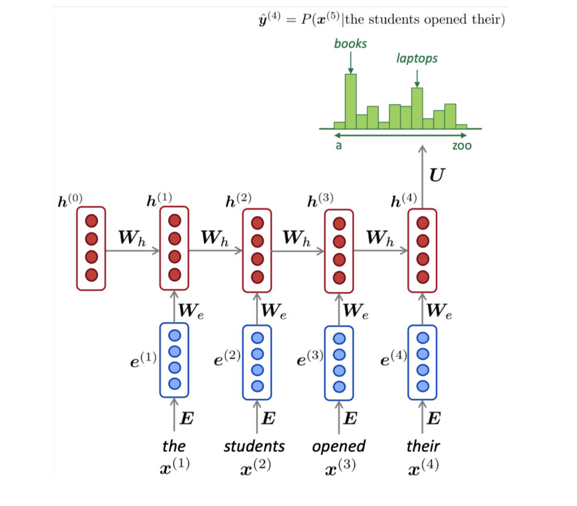
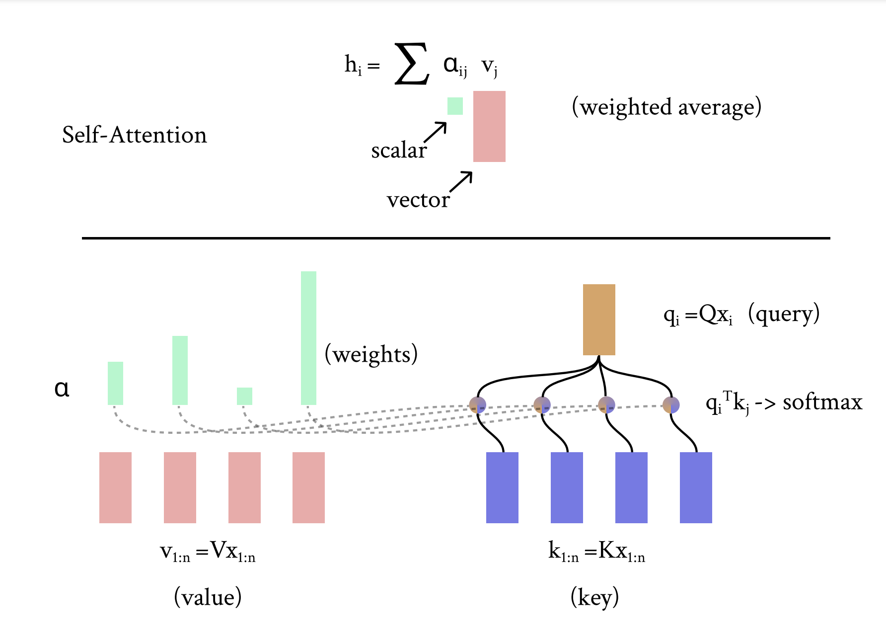
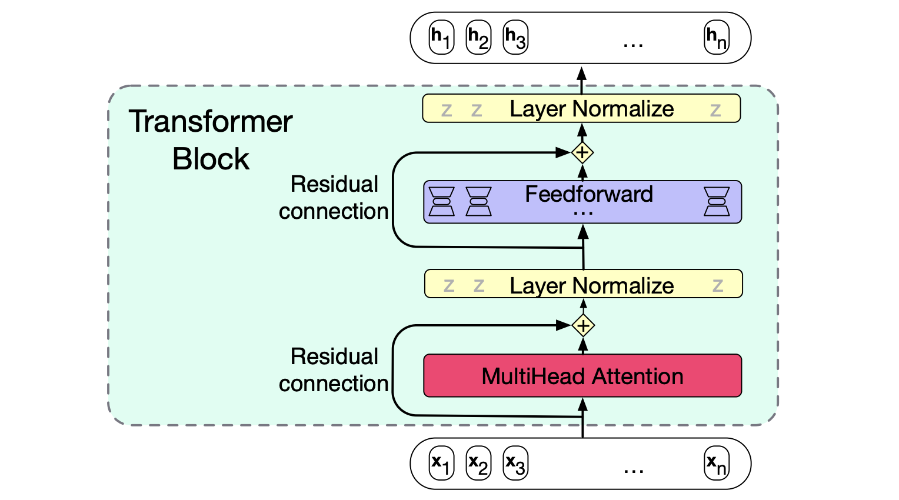
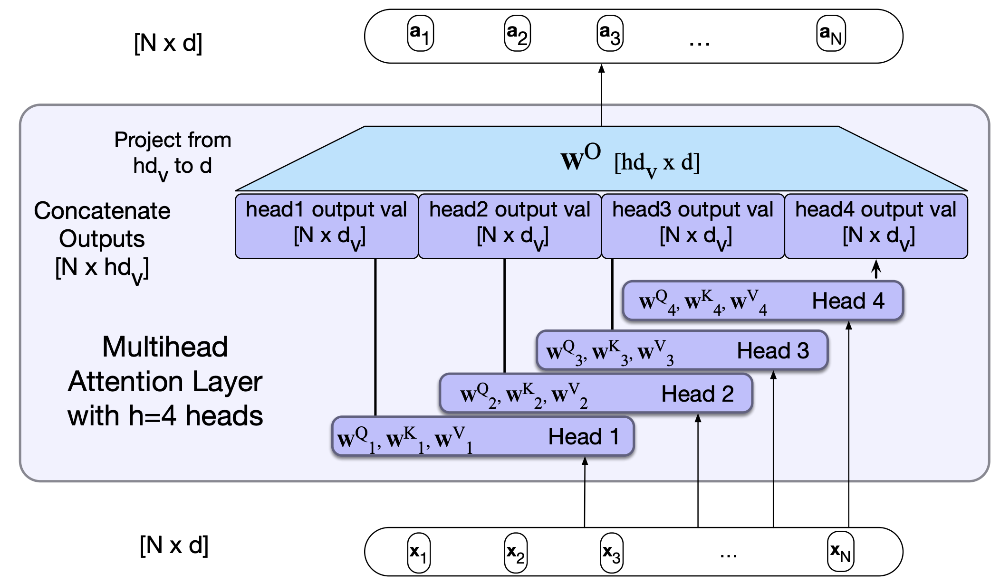
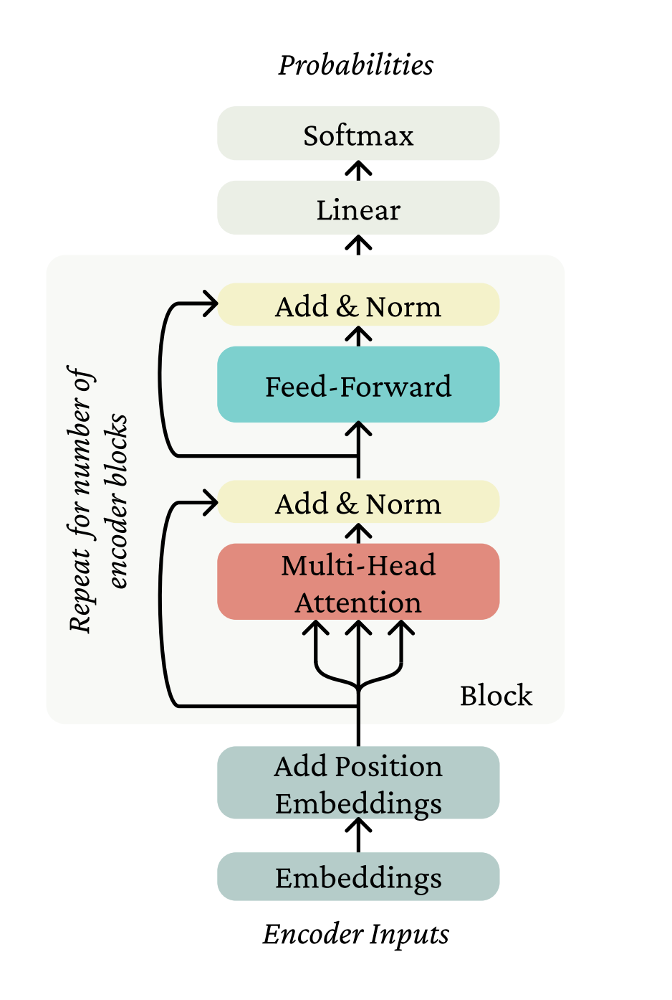
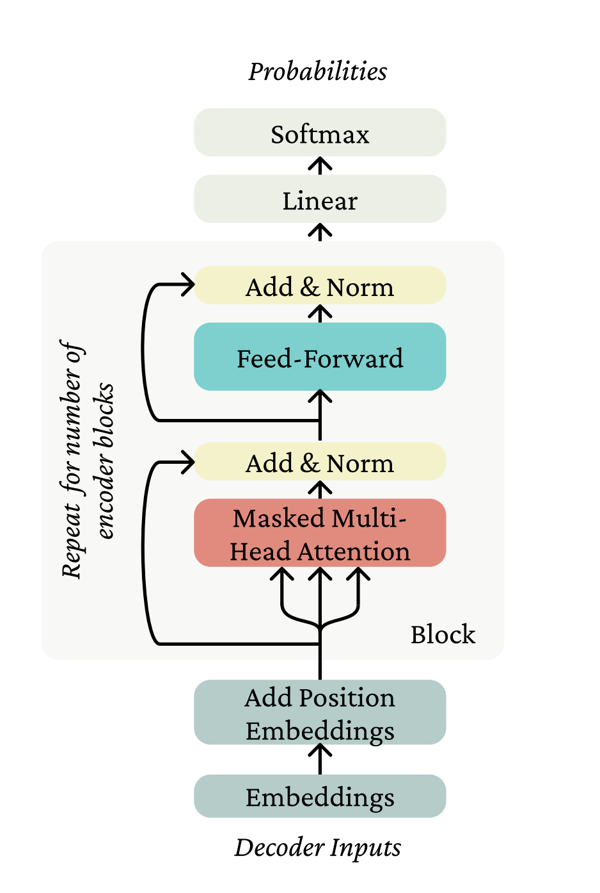

# Self Attention & Transformer

As we know, Attention is all you need[^4] introduced this concept which is building block of **Transformer**.

So let's see in detail.

##### TOC
  - Transformer Architecture
  - RNN for self attention
  - Self attention architecture
    - QKV 
    - Positional representation
    - Future masking
  - Transformer Block
    - Multihead self attention
    - Feedforward layer
    - Layer normalization
    - Residual connection
  - Logit scaling with Softmax
  - Transformer Encoder
  - Transformer Decoder
    - Cross attention

#### Transformer Architecture

<figure markdown="span">
  
<figcaption>Transformer Architecture[1]</figcaption>
</figure>

#### ➤ RNN for self attention

<figure markdown="span">
  
<figcaption>RNN Language Model[3]</figcaption>
</figure>

Recurrent Neural Network is able to conditioning all the previous words in corpus. For time stamp $t$ at hidden layer, there are two inputs ${x_t}$ and output of previous layer ${h}_{t-1}$ which is multiplied by weight matrix ${W}^{(hh)}$ and ${W}^{(hx)}$ (as U in fig) to product output feature ${h}_{t}$, which are further mutiplies by a weight matrix ${W}^{S}$ going through Softmax to predict output ${y}$ (next word).

To put it all together

$$
  \normalsize {ht = \sigma(W^{(hh)}h_{t−1} + W^{(hx)}x_{[t]}) }
$$

$$
  \normalsize {y = \text{Softmax}(W^{(S)} h_{t})}
$$

But the issue with RNNs is the difficulty with which distant tokens in a sequence can interact with each other. 

#### ➤ Self attention architecture

Attention, is a method for taking a query (what we are looking for), and looking up information in a key-value store by picking the values of the key(what we already have in our corpus) most likely matches the query. By averaging overall values, putting more weight on those which correspond to the keys more like the query.

A self-attention layer maps input sequences (x1,...,xn) to output sequences of the same length (a1,...,an). When processing each item in the input, the model has access to all of the inputs up to and including the one under consideration, but no access to information about inputs beyond the current one (No future tokens).

##### - QKV

<figure markdown="span">
  
<figcaption>Query, Key and Value in self attention [1]</figcaption>
</figure>

A token ${x}_{i}$ from sequence ${x}_{1:n}$, and query ${q}_{i}$ for matrix Q. Then for each token $x$ in sequence ${[x_1, x_2, ... x_n]}$, we define both key and value with two weight matrices.

$$
\text{token} \longrightarrow  x_i \\
\text{query}  \longrightarrow q_i \\
\text{key}   \longrightarrow  k_j \\
\text{value}  \longrightarrow v_j \\
$$

So what we basically do is take our element $x_{i}$ and look in its own sequence (it's like looking at our own room in house we are currently standing) with the help of K, Q, V matrices with Softmax.

##### - Positional representation

**In the self-attention operation, there's no built-in notion of order.** Ther are certain things to consider is
  1. the representation of x is not position dependent; it's just Ew for whatever word w
  2. there's no dependence on position in the self-attention operations.

Therefore to represent positions in self attention we **use vectors that are already position-dependent as inputs.** So we add embedded representation of the position of a word (P) to its word embedding. Other way is to change self attention operation itself by adding linear bias but it seems little complex so we will be using positinal encoding here.

$$
\overrightarrow{x}_{i} = P_{i} + x_{i}
$$

##### - Future masking

To stop the current token looking into the future tokens, we used masking by zeroed out(-∞) next tokens to eliminate further information.

$$
\begin{bmatrix}
q1\:k1 & -\infty & -\infty & -\infty & -\infty\\
q1\:k1 & q2\:k2 & -\infty & -\infty & -\infty\\
q1\:k1 & q2\:k2 & q3\:k3 & -\infty & -\infty \\
q1\:k1 & q2\:k2 & q3\:k3 & q4\:k4 & -\infty \\
q1\:k1 & q2\:k2 & q3\:k3 & q4\:k4 & q5\:k5 \\
\end{bmatrix}
$$

#### ➤ Transformer Block

<figure markdown="span">
  
<figcaption>Transformer Block [2]</figcaption>
</figure>

Transformer block includes Feedforward layer, Normalization layer, and Residual connection with Mulrihead attention.

**Computation inside transformer block**

| Steps                         | Description |
|:------------------------------|:---------------------|
| XS = X + selfattention(X)   | Input X of shape [N, d]    |
| XL = LayerNorm(XS)          | Apply layer normalization  |
| XF = FFN(XL)                | Apply feedforward nn       |
| XA = XF + XL                | Concate outputs            |
| HO = LayerNorm(XA)          | Apply layer normalization to get final Head output           |

##### - Multihead self attention

<figure markdown="span">
  
<figcaption>Multihead attention [2]</figcaption>
</figure>

In mutlihead attention, each of the multihead self-attention layers is provided with its own set of key, query and value weight matrices. The outputs from each of the layers are concatenated and then projected to d, thus producing an output of the same size as the input so the attention can be followed by layer norm and feedforward and layers can be stacked.

##### - Feedforward layer

It's common to apply feed-forward network independently to each word representation after self attention. The feedforward layer contains N position-wise networks, one at each position. Each is a fully-connected 2-layer network, i.e., one hidden layer, two weight matrices. The weights are the same for each position, but the parameters are different from layer to layer. Unlike attention, the hidden dimension of the feed-forward network is substantially larger and are independent for each position and so it is efficient to do lot of computation and parameters that can work parallel.

##### - Layer normalization

Layer normalization (layer norm) is one of many forms of normalization that can be used to reduce uninformative variation in the activations at a layer, providing a more stable input to the next layer. Layer norm is a variation of the standard score, or z-score, from statistics applied to a single vector in a hidden layer. The input to layer norm is a single vector, for a particular token position i, and the output is that vector normalized. Thus layer norm takes as input a single vector of dimensionality d and produces as output a single vector of dimensionality d. 

To compute layer norm:

1. computes statistics across the activations at a layer to estimate the mean and variance of the activations
2. normalizes the activations with respect to those estimates, while optionally learning (as parameters) an elementwise additive bias and multiplicative gain by which to sort of de-normalize the activations in a predictable way.

##### - Residual connection

Residual connections are connections that pass information from a lower layer to a higher layer without going through the intermediate layer. Allowing information from the activation going forward and the gradient going backwards to skip a layer improves learning and gives higher level layers direct access to information from lower layer. Residual connections can be implemented by simply adding a layer's input vector to its output vector before passing it forward.

$$
\text{fresidual}\:(h_{1:n}) = f(h_{1:n}) + h_{1:n}
$$

#### ➤ Logit scaling with Softmax

The dot product part comes from the fact that we're computing dot products $q_{i}^{T}\:k_{j}$. The intuition of scaling is that, when the dimensionality d of the vectors are dotting grows large, the dot product of even random vectors grows roughly as $\sqrt{d}$. So, we normalize the dot products by $\sqrt{d}$ to stop scaling.

$$
\normalsize{
\text{softmax} = \left(\frac{x_{1:n}QK^{T}x_{1:n}^{T}}{\sqrt{d}}\right)
}
$$

#### ➤ Transformer Encoder

<figure markdown="span">
  
<figcaption>Transformer Encoder [1]</figcaption>
</figure>

A Transformer Encoder takes a single sequence $w_{1:n}$, and **performs no future masking** at this stage, so even the  first token can see the whole future of the sequence when building its representation. It embeds the sequence with E to make $x_{1:n}$ input format, adds the position representation, and then applies a stack of independently parameterized Encoder Blocks, each of which consisting of multihead attention with Add & Norm, and feed-forward with Add & Norm. So, the output of each Block is the input to the next. 

#### ➤ Transformer Decoder

<figure markdown="span">
  
<figcaption>Transformer Decoder [1]</figcaption>
</figure>

Now to solve the problem with encoder (as we try to build autoregressive model), we use transformer decoder with future masking at each self attention as we seen above.

##### - Cross attention

As in name suggests, unlike self attention(recall looking in same room within house) which looks within own sequence, cross attetion uses one sequence to define the keys and values of self-attention from encoder, and another sequence (from other room) to define the queries (generate intermediate representation of output sequence).

##### Example

- [Understanding Attention Mechanism](https://github.com/kjdeveloper8/nlp-projects/blob/main/src/transformer/attention_mechanism.ipynb)
- [Understanding Transformer architecture](https://github.com/kjdeveloper8/nlp-projects/blob/main/src/transformer/transformer_implementation.ipynb)

#### References
[^1]:
    https://web.stanford.edu/class/archive/cs/cs224n/cs224n.1244/readings/cs224n-self-attention-transformers-2023_draft.pdf
[^2]:
    https://web.stanford.edu/~jurafsky/slpdraft/10.pdf
[^3]:
    https://web.stanford.edu/class/archive/cs/cs224n/cs224n.1244/readings/cs224n-2019-notes05-LM_RNN.pdf
[^4]:
    https://arxiv.org/abs/1706.03762    